# Evaluating Turkish NLP Models: Text Classification and Semantic Search

## Project Overview

This project aims to evaluate and compare the performance of various Turkish Natural Language Processing (NLP) models on two fundamental tasks:

1.  **Part A: Text Classification:** Comparing the performance of a "Standard" and an "Improved" model on a Turkish text classification task. The evaluation in this part includes standard classification metrics such as Accuracy, Precision, Recall, and F1-Score.
2.  **Part B: Semantic Search (Question-Answering):** Testing the ability of various embedding models to find the semantically closest answer to a given question. The performance for this task is measured by Top-1 and Top-5 success rates.

The project consists of multiple Jupyter Notebooks, allowing for modular and parallel execution of different experiments.

---

## Part A: Text Classification Experiment

In this section, the classification performance of a standard model is compared against an improved model on two different Turkish text datasets.

### Datasets

* **TTC-4900:** A dataset used for Turkish text classification.
* **Tars-V1:** Another dataset containing Turkish text.

### Methodology

A baseline classification approach ("Standard Model") is compared against an enhanced version ("Improved Model"). The performance of both models was evaluated using standard classification metrics, and the results have been visualized.

### Results and Visualizations

The results indicate that the "Improved" model consistently outperforms the "Standard" model across all metrics.

#### 1. Accuracy Comparison

Accuracy is the ratio of correctly predicted instances to the total instances. The improved model shows a significant increase in accuracy.

| Standard Model (Accuracy) | Improved Model (Accuracy) |
| :---: | :---: |
|  | 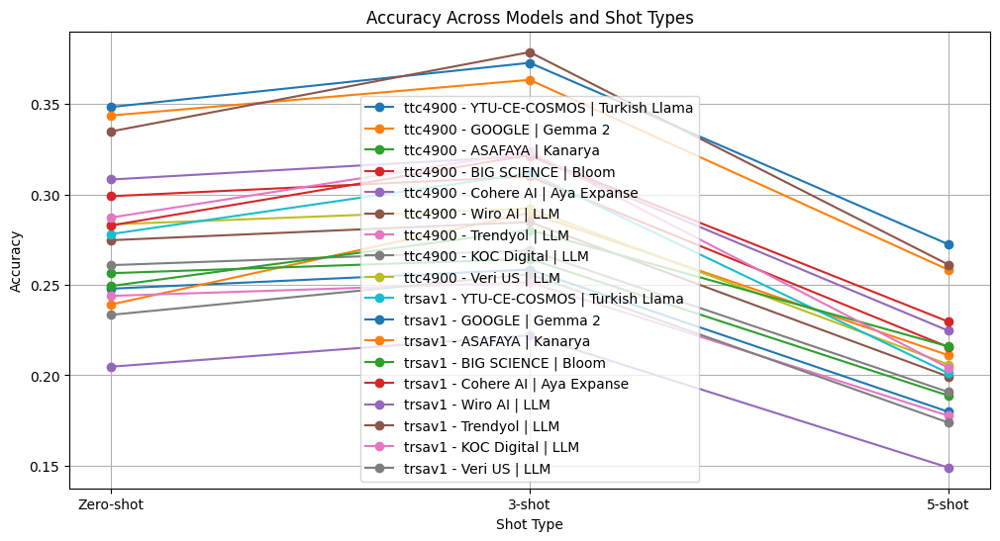 |

#### 2. Precision Comparison

Precision measures how many of the instances predicted as positive are actually positive. The improved model achieves a higher precision rate.

| Standard Model (Precision) | Improved Model (Precision) |
| :---: | :---: |
| 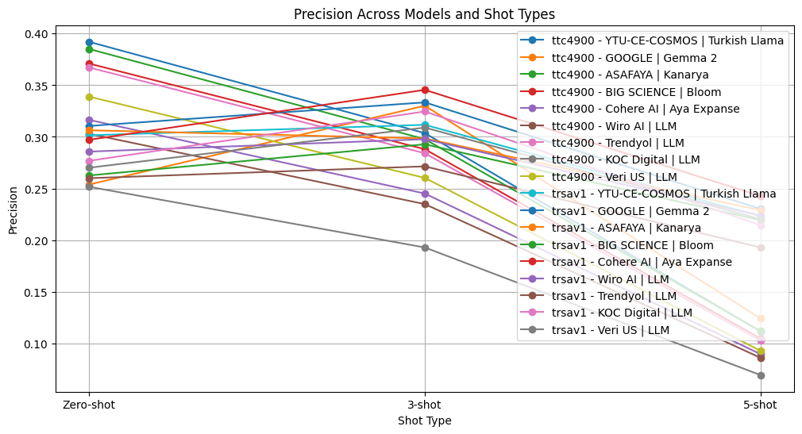 | 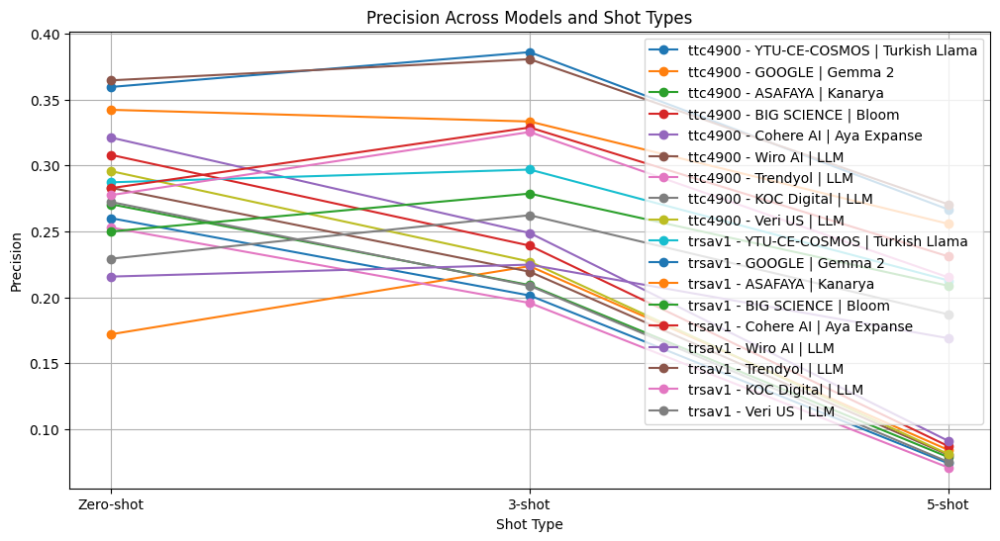 |

#### 3. Recall Comparison

Recall measures how many of the actual positive instances were correctly identified by the model. The improved model is also more successful in this metric.

| Standard Model (Recall) | Improved Model (Recall) |
| :---: | :---: |
| 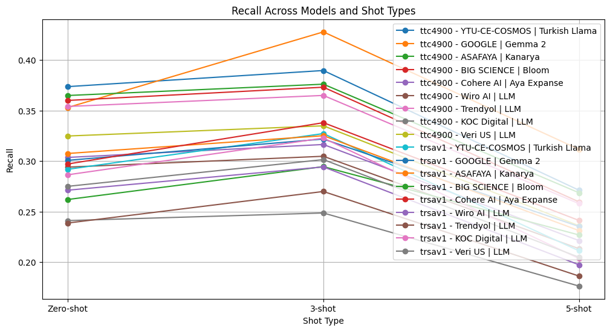 | 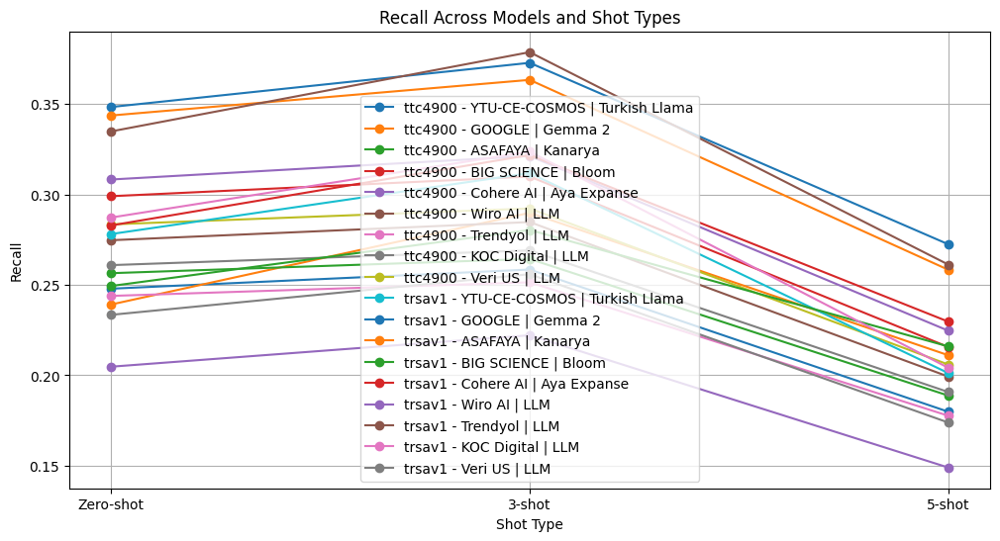 |

#### 4. F1-Score Comparison

The F1-Score is the harmonic mean of Precision and Recall, providing a single metric for overall model performance.

| Standard Model (F1-Score) | Improved Model (F1-Score) |
| :---: | :---: |
| 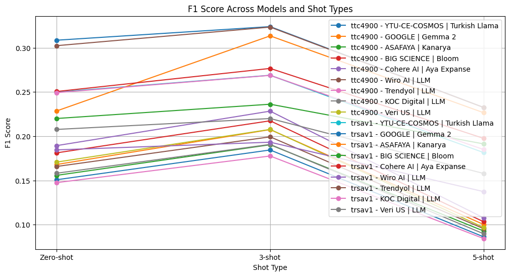 | 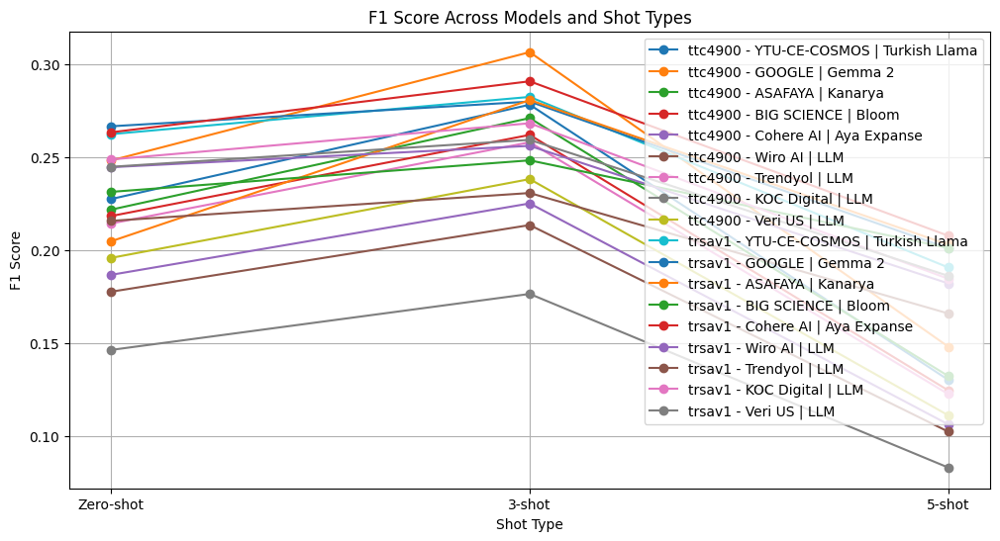 |

#### 5. t-SNE Embedding Visualizations

t-SNE visualizes high-dimensional embedding vectors in a 2D space, helping us understand how well the classes are separated. The images below show the class distributions for the Tars-V1 and TTC-4900 datasets.

| Tars-V1 Distribution | TTC-4900 Distribution |
| :---: | :---: |
| 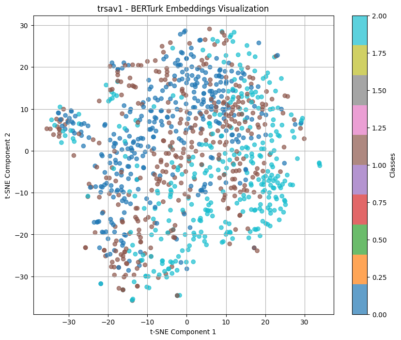 | 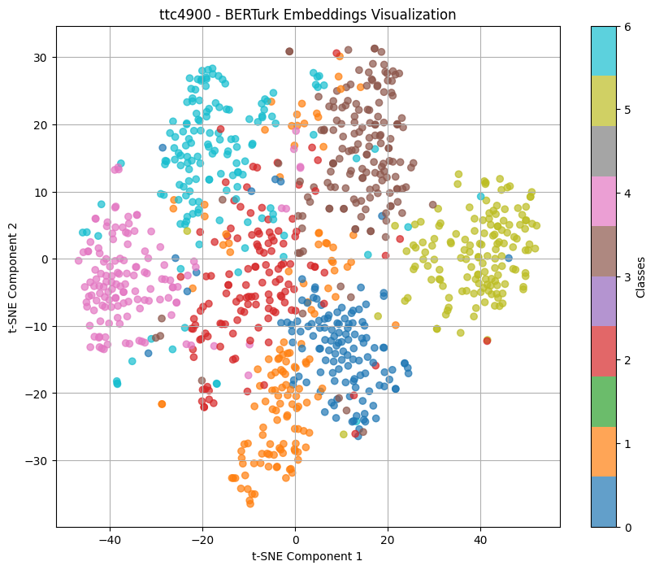 |

---

## Part B: Semantic Search (Question-Answering) Experiment

This section tests the capability of different embedding models to find the correct answer to a question using semantic similarity.

### Dataset

* **`merve/turkish_instructions`**: A random sample of 1,000 question-answer pairs was selected from this dataset on the Hugging Face Hub to form the evaluation set.

### Methodology

1.  **Embedding Generation**: Each model generates numerical vector representations (embeddings) for the question and answer texts.
2.  **Similarity Calculation**: For each question, the cosine similarity is calculated between its embedding and the embeddings of all answer candidates.
3.  **Evaluation**: The model's performance is measured by how highly it ranks the correct answer based on similarity scores:
    * **Top-1 Success Rate**: The percentage of times the correct answer has the highest similarity score.
    * **Top-5 Success Rate**: The percentage of times the correct answer is among the top 5 answers with the highest similarity scores.

### Results and Visualizations

The performance metrics and success rates of the evaluated models are as follows:

#### 1. Metric Comparison Graphs

A comparison of different embedding models based on Accuracy, Precision, Recall, and F1-Score metrics.

| Accuracy | Precision |
| :---: | :---: |
| 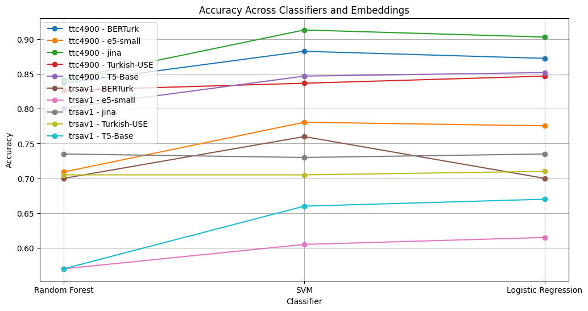 | 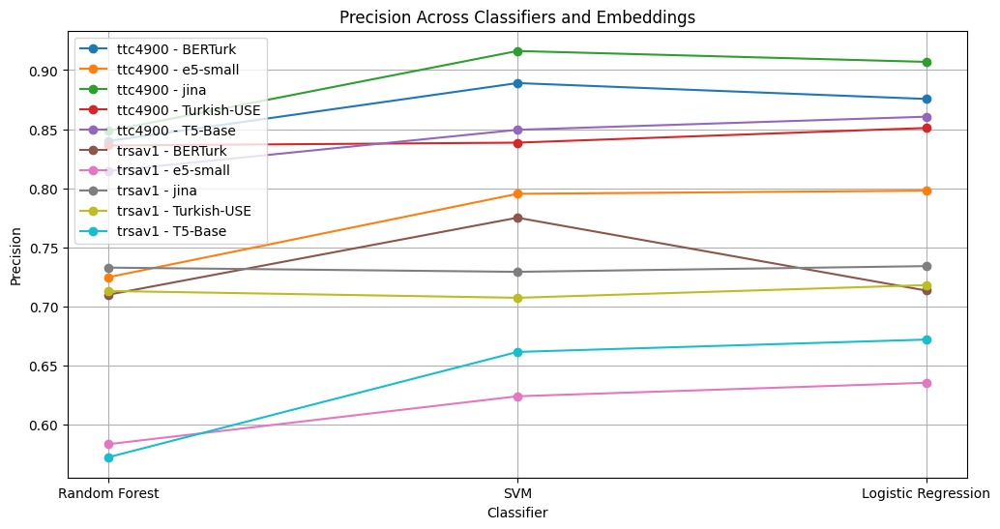 |
| **Recall** | **F1-Score** |
| 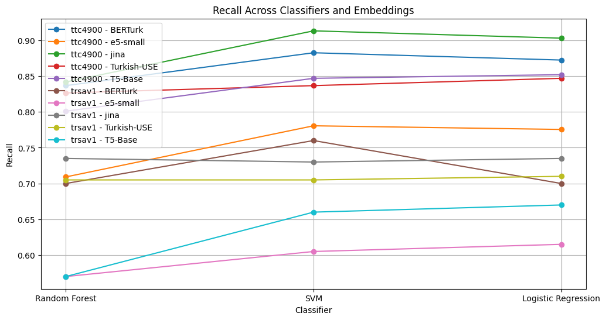 |  |

#### 2. Top-k Success Rates

| Model Name | Top-1 Success Rate | Top-5 Success Rate | Source |
| :--- | :--- | :--- | :--- |
| `multilingual-e5-large` | 2.50% | 4.80% | `outputs/B outputs.txt` |
| `bert-base-turkish-cased` | 3.50% | 4.90% | `a.ipynb`, `outputs/B outputs.txt` |
| `gte-multilingual-base` | 3.10% | 7.50% | `b.ipynb`, `outputs/B outputs.txt` |

---

## How to Run

1.  **Clone the Repository**:
    ```bash
    git clone https://github.com/tugcantopaloglu/text-classification-sementic-search-nlp.git
    cd <your-repository-directory>
    ```
2.  **Install Dependencies** (A GPU-accelerated environment is recommended):
    ```bash
    pip install datasets transformers torch scikit-learn matplotlib pandas
    ```
3.  **Execute a Notebook**: Open and run the cells in any of the provided Jupyter Notebooks (e.g., `a.ipynb` or `b.ipynb`). The first run of `a.ipynb` will generate the `selected_questions_answers.csv` file required by the other notebooks.

## Future Work

The project is designed to be easily extendable. The comments in the source code indicate plans to evaluate a broader range of models in parallel for a comprehensive comparison. Future work could include benchmarking the following models:

* `KaLM-embedding-multilingual-mini-v1`
* `pingkeest/learning2_model`
* `sentence-transformers/paraphrase-multilingual-mpnet-base-v2`
* `Alibaba-NLP/gte-large-en-v1.5`

Additionally, an alternative task of predicting the question from a given answer (`cevaptan soru tahmini`) is mentioned, which presents another avenue for interesting experiments.
